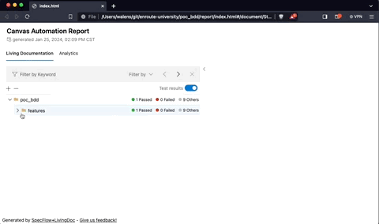

# Canvas WebUI Automation

This project aims to develop an automated testing framework prototype that supports Behavior-Driven.

The objectives are:

1. Establish a robust testing framework for the Canvas web application.
2. Implement end-to-end scenarios that cover critical user journeys.
3. Validate the application's functionality and usability.
4. A custom test execution reporter.

## Technology Stack

- [Behavior-Driven Development (BDD)][bdd] \
  BDD serves as a framework for promoting collaboration, clarity, and shared understanding among stakeholders, with the ultimate goal of delivering high-quality software that meets the needs of its users and the objectives of the business.
- [.NET Core][netcore] \
  A compelling platform for building automation solutions that are robust, performant, and maintainable across different environments and requirements.
- [Playwright][playwright] \
  A comprehensive solution for web automation, combining cross-browser support, cross-platform compatibility, rich features, performance
- [Specflow][specflow] \
  A structured approach to defining, automating, and documenting requirements through executable specifications (Feature).
  - [NUnit][nunit] (Included with Specflow) \
    NUnit is a reliable, feature-rich, and versatile testing framework that provides developers with the tools and capabilities they need to build robust and maintainable test automation solutions in the .NET ecosystem.
  - [LivingDoc][livingdoc] (Specflow) \
    By leveraging LivingDoc, teams can improve communication, clarity, and alignment around requirements, leading to higher-quality software delivery and improved stakeholder satisfaction.

## Dependencies (Pre-Requirements)

- [.NET 8.0][netcore] or above \
  *If you have a higher version of dotnet, update the `<TargetFramework>` in .csproj file*

## One time setup

Run the following commands to setup the project

```sh
# Reinstall nuget packages based on .csproj
dotnet restore

# Build the project
dotnet build

# Install powershell (if you don't have it)
dotnet tool install --global PowerShell

# Install Playwright
pwsh bin/Debug/net8.0/playwright.ps1 install

# Install SpecFlow LivingDoc
dotnet tool install --global SpecFlow.Plus.LivingDoc.CLI
```

- Documentation: [Powershell installation][pwsh]
- Documentation: [Playwright installation][playwright]
- Documentation: [LivingDoc installation][livingdoc]

### Verify One Time setup

```sh
# dotnet - Expect version 8.0.X
dotnet --version

#Powershell
pwsh --v

# PLaywright - Expect version 1.41.1
playwright --version

# Specflow LivingDoc - Expect Framework .NET 8.0.X
livingdoc --version
```

## VSCode setup

If you open the project with VSCode you will might get a set of recommended plugins popup


> [!TIP]
>If you missed it, you can still go to the extensions menu and search `@recommended` to get them in a single list

## Run the tests

```sh
# Run all features and scenarios
dotnet test

# Exclude pending to implement scenarios
dotnet test --filter "Category=automated"

# Run specific user story
dotnet test --filter "Category=ORIGIN-Ticket-008"
# Run by label (epic/feature)
dotnet test --filter "Category=login"
# Run by process
dotnet test --filter "Category=regression-suite"

# Combine filters
# Ex. Run login scenarios that are included in the regression plan and in the login
dotnet test --filter "Category=regression-suite & Category=login"
# Ex. Run scenarios in the login feature "or" the regression plan
dotnet test --filter "Category=regression-suite | Category=login"
```

- Documentation: [dotnet filters][test-filters]

### Tag usage

|Tag Pattern|Description|Example|
|-|-|-|
|`origin-ticket-<Ticket Number>`|Representation of a user story (ticket) to the implemented scenario(s)|@origin-ticket-001|
|`<page name>-page`|Represents a webpage (url) in the webapp|@login-page|
|`<feature/epic name>`|Groups user stories by functionality|@login, @dashboard, @my-settings|
|`automated`|Scenarios with steps implemented|@automated|
|`pending`|Scenarios that are not implemented yet (but the feature file is ready for implementation)|@pending|
|`<test suite name>-suite`|Groups scenarios for the different automation process|@regression-suite, @pr-builder-suite|

> [!NOTE]
> *For consistency, the naming of epics, pages, features should be **hyphen-case**: \
> Use all **lowercase** and **-** instead of spaces.* Ex. **forgot-password-page**

## Reporter

```sh
# Build the app to have the latest changes applied
dotnet build

# Run the tests (You can use filters)
dotnet test

# Generate the html report
livingdoc test-assembly bin/Debug/net8.0/poc_bdd.dll -t bin/Debug/net8.0/TestExecution.json --title "Canvas Automation Report" --output ./report/index.html

# Open the report with your default browser
open ./report/index.html
```

You can click report scenarios in order to see a screenshot taken at each step, this can be useful if a scenario is not working properly



- Documentation: [LivingDoc reports][html-reports]

## BDD Good practices

1. **Gherkin's golden rule** \
  Write feature files so that everyone can intuitively understand them.
2. **The cardinal rule of BDD** \
  One scenario should cover exactly one single, independent behaviour.
3. **The unique example rule** \
  Don't include unnecessary examples.
4. **The good grammar rule** \
  Behaviour scenarios are meant to be readable and expressive. Steps are meant to be reusable.

- Article: [Writting Good Gherkin][gherkin_rules]
- Video: [How to Write Good Gherkin for BDD][[good-gherkin-for-bdd]]
- Article: [Cucumber anti-patterns][anti-pattern]
- Article: [Gherkin reference][cucumber-gherkin]

## Workflows

- **pr-builder**
  This workflow is executed everytime a Pull Request is created/updated
  - Scenario Scope: Quick validation
  - Include
    - Critical scenarios
    - Core pages/interactions
- **regression**
  This workflow is executed on a schedule twice per day (12 AM/12 PM) and everytime release branch receives a commit (push or merge)
  - Scenario Scope: Detailed picture
  - Include
    - All automated scenarios
- **release** \
  This workflow is executed the last day of the month 12 AM, prior to the release.
  - Scenario Scope: Big picture
  - Include
    - Basic functionality of the application
    - Acceptance criteria defined by stakeholders

## Display browser and slow motion

If you want to see what the step is doing in real time you can deactivate the `Headless` mode (`Default true`). \
If the browser steps are too fast to keep track you can add the `SlowMo`, this will add a delay between every browser action (non-browser actions are not delayed)

```cs
// file::./hooks/hooks.cs
IBrowser browser = await playwright.Chromium.LaunchAsync(new() {
  Headless = false,
  SlowMo = 500,
});
```

> [!CAUTION]
> Avoid including Headless or SlowMo into your PR or the workflows may timeout

## Developer quick reference

- NUnit [Assertions][assert]
- Specflow [Hooks][hooks]
- Playwright [Locators guide][locators-guide]
- Playwright [Locator class][locator-class]

[netcore]: https://dotnet.microsoft.com/es-es/download/dotnet/8.0
[bdd]: https://cucumber.io/docs/bdd/
[nunit]: https://docs.nunit.org/
[pwsh]: https://github.com/PowerShell/PowerShell
[playwright]: https://playwright.dev/dotnet/docs/intro
[livingdoc]: https://docs.specflow.org/projects/specflow-livingdoc/en/latest/LivingDocGenerator/Installing-the-command-line-tool.html
[specflow]: https://docs.specflow.org/projects/specflow/en/latest/

[test-filters]: https://docs.specflow.org/projects/specflow/en/latest/Execution/Executing-Specific-Scenarios.html
[html-reports]: https://docs.specflow.org/projects/specflow/en/latest/Tools/Reporting.html

[gherkin_rules]: https://www.gherkinuft.com/gherkin/
[good-gherkin-for-bdd]: https://www.youtube.com/watch?v=YD7pHObAROM
[anti-pattern]: http://www.thinkcode.se/blog/2016/06/22/cucumber-antipatterns
[cucumber-gherkin]: https://cucumber.io/docs/gherkin/reference/

[assert]: https://docs.nunit.org/articles/nunit/writing-tests/assertions/assertions.html
[hooks]: https://docs.specflow.org/projects/specflow/en/latest/Bindings/Hooks.html
[locators-guide]: https://playwright.dev/dotnet/docs/locators
[locator-class]: https://playwright.dev/dotnet/docs/api/class-locator
